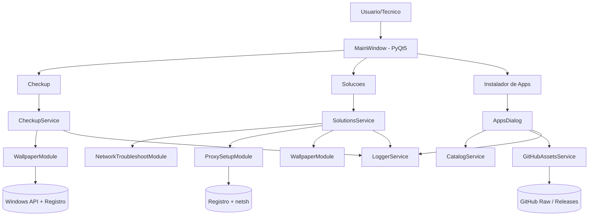
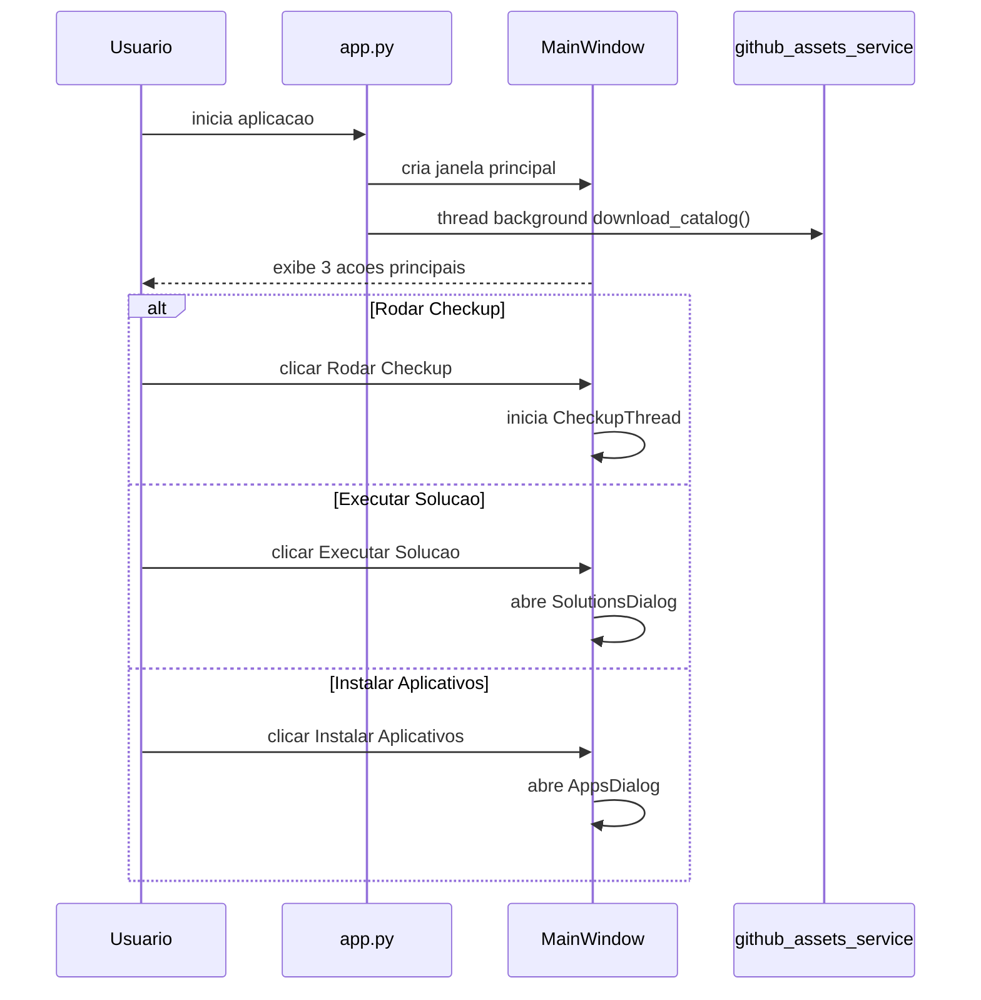
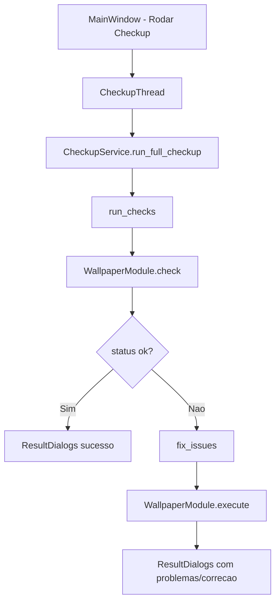
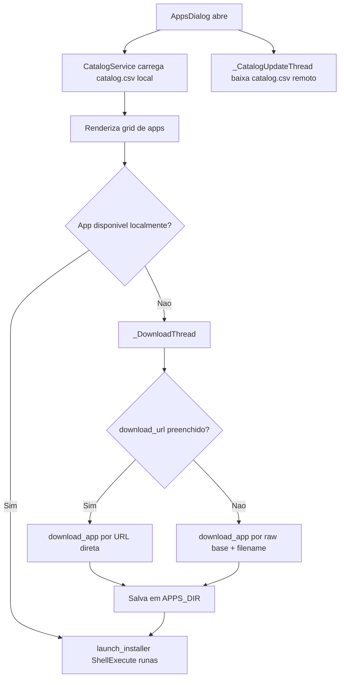
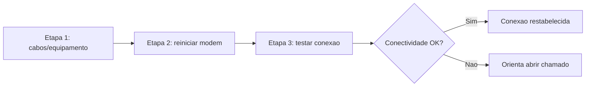
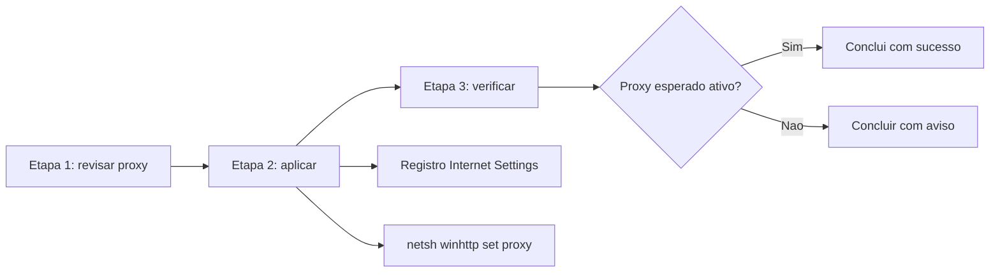
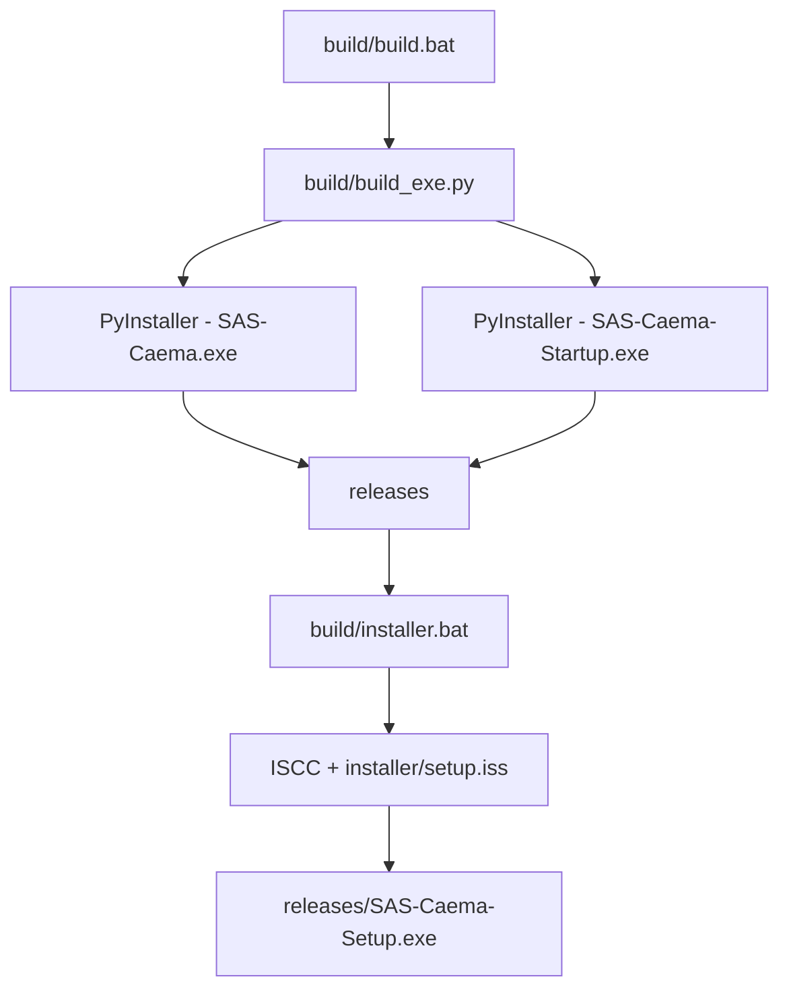

# Diagramas da Aplicacao

Este arquivo concentra diagramas Mermaid para entendimento rapido do sistema.

## 1. Arquitetura de alto nivel

## 2. Fluxo da aplicacao principal

## 3. Fluxo do checkup

## 4. Fluxo do instalador de aplicativos

## 5. Fluxo de solucao de rede

## 6. Fluxo de configuracao de proxy

## 7. Build e instalador

