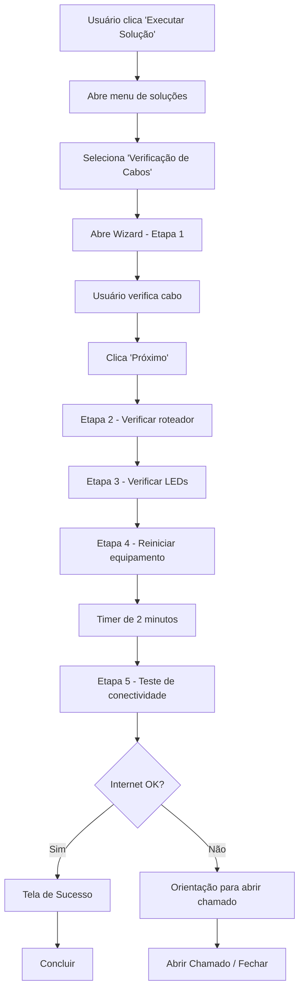

# Documentação - Módulo de Verificação de Cabos de Rede

## Visão Geral

O módulo **"Verificação de Cabos de Rede"** é uma solução de troubleshooting passo-a-passo que guia o usuário através de verificações básicas antes de acionar o suporte técnico. Este módulo se integra ao sistema SAS-Caema através do botão "Executar Solução" na janela principal.

## Objetivo

Reduzir chamados desnecessários ao suporte técnico fornecendo um tutorial interativo que permite ao usuário:
1. Verificar problemas físicos de conexão de rede
2. Realizar diagnósticos básicos de conectividade
3. Executar soluções simples de forma independente
4. Solicitar suporte apenas quando necessário

## Arquitetura do Módulo

### Estrutura de Diretórios

```
app/modules/network_troubleshoot/
├── __init__.py
├── main.py                          # Classe principal do módulo
├── config.py                        # Configurações do módulo
├── services/
│   ├── __init__.py
│   ├── network_checker.py          # Serviço de verificação de conectividade
│   └── step_validator.py           # Validação de conclusão de etapas
├── views/
│   ├── __init__.py
│   ├── wizard_window.py            # Janela principal do wizard
│   └── step_widgets.py             # Widgets para cada etapa
└── assets/
    ├── step1_placeholder.png       # Imagem placeholder - verificar cabos
    ├── step2_placeholder.png       # Imagem placeholder - verificar roteador
    ├── step3_placeholder.png       # Imagem placeholder - verificar luzes
    ├── step4_placeholder.png       # Imagem placeholder - reiniciar equipamento
    └── step5_placeholder.png       # Imagem placeholder - teste de conectividade
```

## Componentes Principais

### 1. NetworkTroubleshootModule (main.py)

Classe principal que implementa a interface padrão dos módulos SAS-Caema.

**Métodos:**
- `execute()`: Abre a janela do wizard de troubleshooting
- `check()`: Verifica status atual da conectividade (não usado neste módulo)

### 2. WizardWindow (views/wizard_window.py)

Interface PyQt5 que apresenta o wizard passo-a-passo.

**Características:**
- Navegação sequencial (não permite pular etapas)
- Botões: "Próximo", "Voltar", "Concluir", "Cancelar"
- Indicador visual de progresso (ex: "Etapa 2 de 5")
- Layout responsivo e intuitivo

**Etapas do Wizard:**

#### Etapa 1: Verificação Física do Cabo de Rede
- **Título**: "Verificar Conexão do Cabo de Rede"
- **Instrução**: "Verifique se o cabo de rede está firmemente conectado ao seu computador e ao roteador/switch."
- **Imagem**: Diagram mostrando cabo conectado ao computador e roteador
- **Checklist**:
  - [ ] Cabo conectado ao computador
  - [ ] Cabo conectado ao roteador/switch
  - [ ] Cabo sem danos visíveis
- **Botão**: "Próximo" (habilitado sempre)

#### Etapa 2: Verificação do Roteador/Modem
- **Título**: "Verificar Alimentação do Roteador/Modem"
- **Instrução**: "Certifique-se de que o roteador ou modem está ligado e funcionando corretamente."
- **Imagem**: Roteador com luzes indicadoras acesas
- **Checklist**:
  - [ ] Roteador/modem está ligado na tomada
  - [ ] Luzes indicadoras estão acesas
  - [ ] Equipamento não apresenta sinais de aquecimento excessivo
- **Botão**: "Próximo"

#### Etapa 3: Verificar Luzes de Conexão
- **Título**: "Verificar Indicadores de Conexão"
- **Instrução**: "Observe as luzes indicadoras na porta de rede do seu computador e do roteador."
- **Imagem**: Porta de rede com LED aceso
- **Informação**:
  - ✓ LED aceso/piscando = Conexão detectada
  - ✗ LED apagado = Sem conexão física
- **Checklist**:
  - [ ] LED da porta do computador está aceso
  - [ ] LED da porta do roteador está aceso
- **Botão**: "Próximo"

#### Etapa 4: Reiniciar Equipamentos
- **Título**: "Reiniciar Equipamentos de Rede"
- **Instrução**: "Vamos reiniciar o modem/roteador para restabelecer a conexão."
- **Imagem**: Ilustração de desconexão e reconexão de equipamento
- **Passos**:
  1. Desligue o modem/roteador da tomada
  2. Aguarde 30 segundos
  3. Ligue novamente o equipamento
  4. Aguarde 2 minutos para inicialização completa
- **Timer**: Contador visual de 2 minutos
- **Botão**: "Próximo" (habilitado após timer)

#### Etapa 5: Teste de Conectividade
- **Título**: "Verificar Conectividade de Internet"
- **Instrução**: "Agora vamos testar se a internet foi restabelecida."
- **Ação**: Botão "Testar Conexão" executa ping para servidores conhecidos
- **Resultados possíveis**:
  - ✓ **Sucesso**: "Conexão restabelecida! O problema foi resolvido."
  - ✗ **Falha**: "A conexão ainda não foi restabelecida. É necessário abrir um chamado para o suporte."

**Tela de Conclusão:**
- **Se Internet OK**: 
  - Mensagem de sucesso
  - Botão "Concluir"
- **Se Internet continua sem conexão**:
  - Orientação para abrir chamado
  - Informações coletadas durante o diagnóstico
  - Botão "Abrir Chamado" (abre sistema de tickets ou fornece instruções)
  - Botão "Fechar"

### 3. NetworkChecker (services/network_checker.py)

Serviço responsável por testar a conectividade de rede.

**Métodos:**
- `check_internet_connectivity()`: Testa conexão realizando ping para múltiplos servidores
- `get_network_adapter_status()`: Verifica status dos adaptadores de rede
- `ping_host(host, timeout)`: Executa ping para um host específico
- `get_diagnostic_info()`: Coleta informações de diagnóstico (IP, gateway, DNS)

**Servidores de Teste:**
- 8.8.8.8 (Google DNS)
- 1.1.1.1 (Cloudflare DNS)
- Portal da Caema (se aplicável)

### 4. StepValidator (services/step_validator.py)

Gerencia a validação e controle de fluxo entre etapas.

**Métodos:**
- `validate_step(step_number)`: Valida se a etapa pode ser concluída
- `mark_step_complete(step_number)`: Marca etapa como concluída
- `can_proceed_to_next()`: Verifica se pode avançar para próxima etapa
- `get_progress()`: Retorna progresso atual (ex: 3/5)

### 5. Configurações (config.py)

```python
# Configurações do módulo de verificação de rede

# Diretórios
ASSETS_DIR = Path(__file__).parent / "assets"

# Configurações de teste de rede
NETWORK_TEST_HOSTS = [
    "8.8.8.8",        # Google DNS
    "1.1.1.1",        # Cloudflare DNS
]
PING_TIMEOUT = 3      # segundos
PING_COUNT = 4        # número de pings

# Configurações de UI
STEP_COUNT = 5
RESTART_TIMER_SECONDS = 120  # 2 minutos

# Textos das etapas
STEP_TITLES = {
    1: "Verificar Conexão do Cabo de Rede",
    2: "Verificar Alimentação do Roteador/Modem",
    3: "Verificar Indicadores de Conexão",
    4: "Reiniciar Equipamentos de Rede",
    5: "Verificar Conectividade de Internet"
}
```

## Integração com a Aplicação Principal

### 1. Atualização do MainWindow

O botão "Executar Solução" (`btn_solution`) na janela principal será modificado para:
1. Abrir um menu/dialog de seleção de soluções disponíveis
2. Inicialmente, apenas "Verificação de Cabos de Rede" estará disponível
3. Ao selecionar, instancia e executa `NetworkTroubleshootModule`

### 2. Registro do Módulo

O módulo não é registrado no CheckupService (pois não faz parte do checkup automático), mas é registrado em um novo `SolutionsService` que gerencia soluções de troubleshooting disponíveis.

## Fluxo de Uso



## Benefícios

1. **Redução de chamados**: Usuários resolvem problemas simples sozinhos
2. **Padronização**: Todos seguem o mesmo procedimento de verificação
3. **Educação**: Usuários aprendem a identificar problemas básicos
4. **Diagnóstico**: Coleta informações úteis para o suporte quando necessário
5. **Eficiência**: Suporte foca em problemas complexos

## Tecnologias Utilizadas

- **PyQt5**: Interface gráfica do wizard
- **subprocess/ping**: Testes de conectividade
- **pathlib**: Manipulação de arquivos e assets
- **Logger**: Registro de atividades e diagnósticos

## Extensibilidade

O sistema de "Executar Solução" é projetado para ser extensível. Futuros módulos podem incluir:
- Verificação de impressora
- Verificação de VPN
- Limpeza de cache/temp
- Diagnóstico de performance
- Reset de senha local

Cada novo módulo seguirá o mesmo padrão de wizard com etapas sequenciais.

## Considerações de UX

1. **Clareza**: Instruções simples e diretas
2. **Visual**: Imagens ilustrativas em cada etapa
3. **Progresso**: Indicador claro de onde o usuário está no processo
4. **Não-invasivo**: Não executa ações automáticas sem consentimento
5. **Feedback**: Confirmação visual para cada ação
6. **Escape**: Botão "Cancelar" sempre disponível

## Manutenção

- **Imagens**: Substituir placeholders em `assets/` por imagens reais e contextualizadas
- **Textos**: Ajustar instruções conforme feedback dos usuários
- **Testes**: Adicionar mais servidores de teste se necessário
- **Tradução**: Preparado para i18n se necessário no futuro
